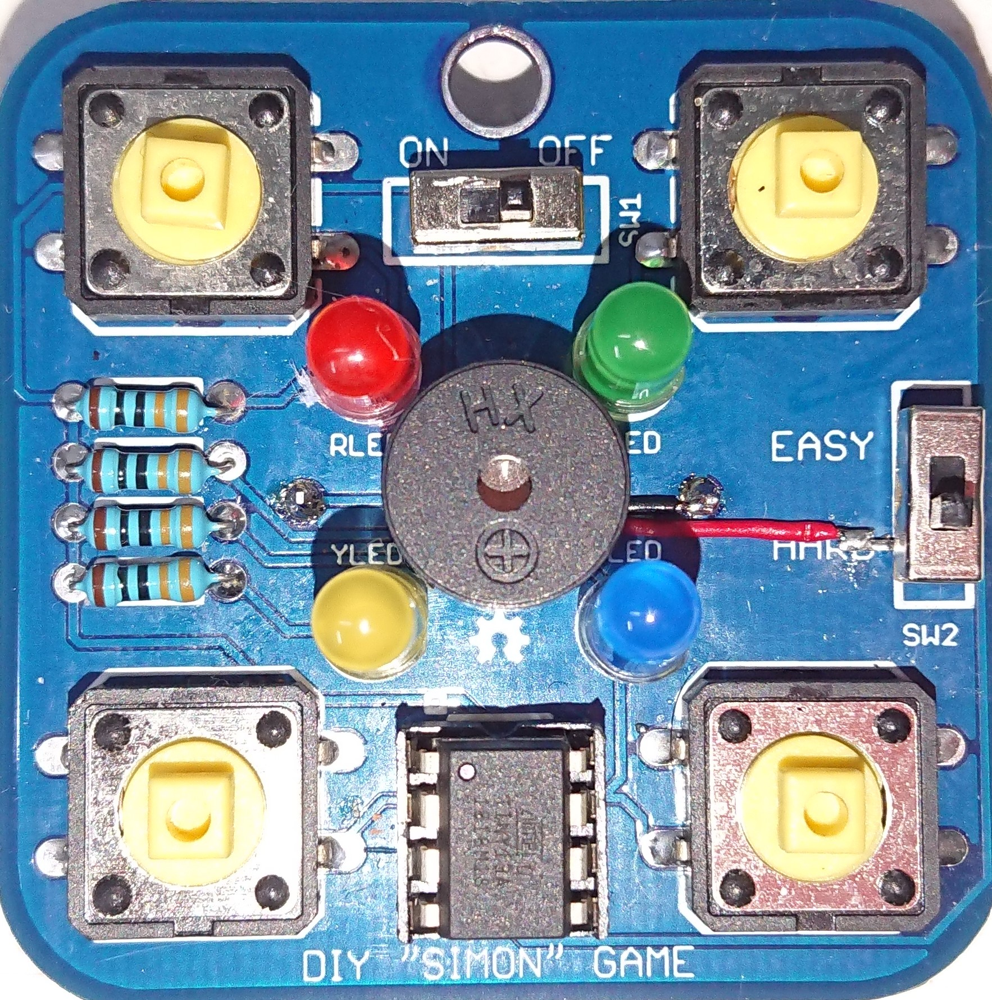

# Simon Says Game in ATTiny13 MCU

## Description
This project is based in the e-radionica solder kit [[1]], [[2]] and the fantastic hackaday Simon Says project [[3]] by Vodja [[4]] with some modifications.
The aim of this project is to create a simple but still playable toy which can be used to learn basic skills in electronics.

## Characteristics
- Simon Says game
- With original sound and original timeout
- Less than 1kB code
- Power ON/OFF switch
- Sound ON/OFF switch (or not kill me neighbors’ mode :-)
- Persistent best score and best sequence
- Secret mode: try it again
- Secret mode: restart same sequence
- Secret mode: clear best score
- Secret mode: two players mode - original emulation
- Loss, Win, Best Score, Final and Easer Egg LED animations
- Easer Egg - Random Jazz Machine (to dance with your friends)
- Easer Egg = Cycle advise light (stay safety :-)
- Power ON forgot alarm
- Low power consumption. Up to 5,5h with a 210mAh CR2032 battery
- Highly optimized for attiny13a MCU

## Details
The heart of the game is ATtiny13. It is low power AVR 8-bit microcontroller with 1 kB flash memory, 64 bytes EEPROM and 64 bytes SRAM.

It has six I/O pins, from which one acts as a reset, this is not used in this project; four are connected to LEDs and buttons and the last one leads to the magneto dynamic buzzer. The device is powered from CR2032 lithium cell or compatible.

As mentioned, the device contains four LEDs of different colors (red, blue, yellow and green) connected with four button switches. Because each LED has different efficiency, resistors of different values must be connected in series with them.

After pressing each of those buttons, the LED lights up and information about the button state can be read by a microcontroller. The pins of a microcontroller are bi-directional, so they can be changed from input to output in any time and can control LEDs instead of the buttons.

The low-impedance (16 ohm) buzzer is connected from a pin port to ground avoiding the decoupling capacitor, the free well diode in the GPIO port eliminates the reversed voltage peak in the coil. Like in an original game, each color is producing a particular tone when it is pressed or activated by the microcontroller and the frequencies are in an exact ratio 3:4:5:6 (50% duty cycle). The sound can be switched ON/OFF with the modified EASY/HARD level switch.

To avoid to making short-circuit on output pins, changing between input and output can be done only in low state (disabled internal pull-up resistor). 

Sufficient pseudo-random sequences are generated by a simple linear-feedback shift register, [FSR]

The value of random seed is generated from jitter between watchdog timer and calibrated RC oscillator and padding with zeros, the probability of repeating the same sequence 1/255, which it is still low enough yet. We are playing.

The watchdog timer is used also for buttons debouncing, for base time and for timeout after 4 seconds of inactivity. The system loops leds and sound every 6 seconds if not activity was detected to advise that the system is powered.

Best score is saved to the EEPROM (including the seed), so it is possible to re-play the best game (even after removing the battery).

The concept of this electronic set is to make it easy to build without any special tools or skills, and instruct about the concept of hacking the hardware with an easy modification over the original PCB that yields a better and vitaminic game.

## How it works
Normal mode: When the game is started switching ON with the ON/OFF switch, random seed is generated and you have to memorize and repeat increasing sequence of colors and tones. In higher levels the game goes faster. If you make a mistake, the correct LED blinks three times and game-over animation is played. If you have beaten the best score, your game (achieved level and seed value) is saved to the EEPROM and best-score animation is played. When you rearch the maximum level (32 levels), a special final animation plays the pseudo-random sequence (starting by your best seed). It takes almost 3.5 hours before the sequence starts repeating.

## Secret modes:
These modes are activated in the boot sequence. There are two ways to activated these modes: 
- With the power ON/OFF switch: In power OFF, press the required button and turn ON the game. 
- With the Timeout Watchdog Reset: In Power ON, press and hold the required button for 6 or more seconds.
When you release the button, the secret mode is activated until new Power OFF or Reset sequence.

 1. **Green button**, you can continue with the best-scored game. It starts on the highest achieved level.
 2. **Red button**, you can play the best-scored game from the beginning.
 3. **Yellow button**, the best score is erased and you start a new random game as in the first case.
 4. **Blue button**, by pressing the blue button you will start a player vs player battle mode. After the startup animation player1 must initiated the duel pressing a button and switching to player2 that must repeat the sequence and increase a new level. The loop must be repeated to fail. This mode has been cloned from the original Simon Says.
 
## Easer Egg:
 The Easer Egg is activated when you insert a specific sequence in the two players mode... 
 You can use this Easer Egg for a crazy party... or maybe you can use this Easer Egg as warning or advise bicycle light (if you forget your one).

## Video

## Modify the hardware:
### Adding the Buzzer  
It is very simple modify the original hardware:
1. Blend the HARD-labeled terminal in the original difficult switch, SW2. Ensure that he blended terminal do not touch the ground pad in the pcb!!
2. Weld the ground speaker terminal to the battery ground in the pcb.
3. Weld the positive speaker terminal to the blended switch terminal.

This is a picture showing the modifications:

  

You can buy this inexpensive speaker [here][Buzzer Aliexpress]

### Led Resistors
Because each LED has different efficiency, resistors of different values must be connected in series with them. 
This is a optional modification that could be useful to learn about [Resistors Color Code]

In this table we can see the different Forward Voltage (directly measured from the supplied diodes), the efficacy upon color [Led Efficacy] and the calculated resistor: 

|Led-Color| Forward Voltage (V) | Efficacy  (lm/W)| Resistor (ohm) |
|--------:|:-------------------:|:---------------:|---------------:|
|Blue     |2,585                | 37              | 100            |
|Red      |1,815                | 72              | 330            |
|Green    |1,875                | 93              | 380            |
|Yellow   |1,880                | 98              | 240            |

## Electrical considerations
- Optionally you can activate BOD 2,7V in the compiler settings to avoid failures in the blue led activation under low battery status.
- Also, this activation avoids full discharge in ion lithium LIR2032 rechargeable battery.

- ATTiny13a ports pins source and sinking current are the same and limited to 5mA (10mA in PB0-PB1). This allows activate the buzzer in positive logic (PB3 pin) and avoid to use a decoupling capacitor. 

## Consumption
Logging consumption in a real device yields a 9,8mA/0,2mA maximum/minimum current in normal average mode.
Integrating in time and assuming 4 beeps (250ms duration) per second (worst case) we obtain the follow table:

|Battery Type        | Energy (mAh) | Total Time (h)  |
|-------------------:|:------------:|:---------------:|
|Duracel CR2032      |210           | 5,50            |
|Chinorris CR2032    |140           | 3,60            |
|Recargable LIR2032  |40            | 1,04            |
|Recargable MC2032   |60            | 1,57            |

Some simplifications supposed.
It is strongly recommended to use rechargeable power cell to minimize the use of hazardous substances!!!

## Know Issues
- Buzzer in a no dedicated timer pin (PB0, PB1) generates extra code

## Future Improvements
- Redesign PCB to allow buzzer in PB0 or PB1 pin
- Add LIR2032 charger

## Software
### Main simplifications over original code
- Delay Base Time
- Increasing difficult with time
- Random - ADC eliminated (not works as specter)
- EEPROM
- Sleep mode eliminated
- Minor simplifications, seed, variable space
### Addons
- Two Players
- Jazz Machine
- Timeout Reset

## Compilation and programing
You must compile the program with avr-gcc v5.4.0 tool provided in Arduino 1.6.9 ide distribution to obtain a 1008 bytes of program storage space.
Core installation in Arduino IDE from
Arduino core for attiny13 - https://mcudude.github.io/MicroCore/package_MCUdude_MicroCore_index.json

Configuration:
  Tools options:
  Board: "Attiny13"
  B.O.D: "2.7v"
  Clock: "1.2 MHz internal osc."
  GCC Flags: "-Os LTO enabled (default)"

Programmer: "Arduino as ISP"

## Reference Libraries:
 - [MicroCore]
 - [picoCore]

## License
This project with exception of the software is licensed under a [Creative Commons Attribution-NonCommercial 4.0 International License][Creative Commons]. The software (source and binary) is licensed under the [MIT License][The MIT License]. 

 
[1]: https://www.tindie.com/products/e-radionica/simon-says-diy-learn-to-solder-kit/ "buy on tindie" 
[2]: https://e-radionica.com/en/simon-says-kit.html "buy on e-radionica"
[3]: https://hackaday.io/project/18952-simon-game-with-attiny13 "reference project"
[4]: https://hackaday.io/vojtak "hackaday simon attiny13, father"

[MicroCore]: https://github.com/MCUdude/MicroCore
[picoCore]: https://github.com/nerdralph/picoCore
[Creative Commons]: https://creativecommons.org/licenses/by-nc/4.0/
[The MIT License]: https://opensource.org/licenses/MIT
[Buzzer Amazon]: https://www.amazon.es/gp/product/B07Y82W2H8
[Buzzer Aliexpress]: https://es.aliexpress.com/item/4000203106698.html
[FSR]: https://en.wikipedia.org/wiki/Linear-feedback_shift_register
[Resistor Color Code]: https://static4.arrow.com/-/media/arrow/images/miscellaneous/h/how-to-read-resistor-color-codes.jpg
[Led Efficacy]: https://www.electronicshub.org/light-emitting-diode-basics/
